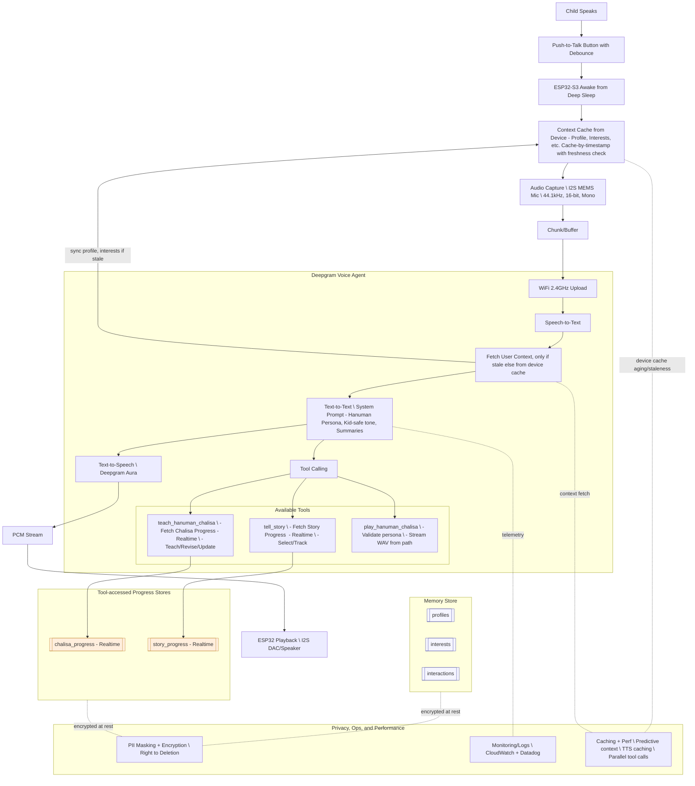
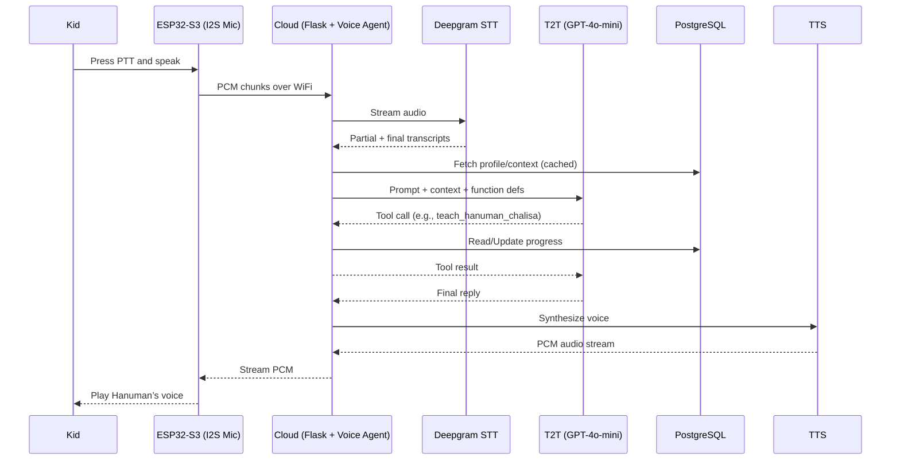

# Voice Agent Function Calling Python Demo

This repository serves as a reference implementation for integrating function calling capabilities with Deepgram's Voice Agent API using Python Flask. It demonstrates production-ready patterns for building AI Voice Agent applications with clientside function calling. In addition, it surfaces logs to the user to help understand the flow from user to assistant to LLM.

## UI


## Sign-up to Deepgram

Before you start, it's essential to generate a Deepgram API key to use in this project. [Sign-up now for Deepgram](https://console.deepgram.com/signup).

## Quickstart

This reference implementation demonstrates:

- Core function calling patterns with Voice Agent API
- Using Python Flask to build a simple web application
- Natural conversation flow using agent filler messages
- Customer information lookup and verification
- Order history retrieval
- Appointment scheduling and management
- Graceful conversation termination through an `end_call` function
- Logging in the UI for debugging

### Function Calling Architecture
The implementation uses a three-layer architecture:
- Function definitions that guide the LLM's behavior
- Function handlers that route requests
- Business logic that executes the actual functionality

### Natural Conversation Flow
Shows how to implement natural dialogue patterns:
- Agent filler messages for lookup operations
- Proper message sequencing
- Audio completion handling
- Clean session termination

## Project Structure

```
├── common/
│   ├── agent_functions.py    # Function definitions and routing
│   ├── business_logic.py     # Core function implementations
│   ├── config.py             # Configuration settings
│   ├── log_formatter.py      # Logger setup
├── client.py             # WebSocket client and message handling
```

## Mock Data System

The implementation uses a mock data system for demonstration:
- Generates realistic customer, order, and appointment data
- Saves data to timestamped JSON files in `mock_data_outputs/`
- Configurable through `config.py`

### Artificial Delays
The implementation demonstrates how to handle real-world latency:
- Configurable database operation delays in `config.py`
- Helps simulate production environment timing

## Setup Instructions

0. Make sure you have portaudio installed.

In macOS:
```bash
brew install portaudio:
```

In Ubuntu:
```bash
sudo apt-get install portaudio19-dev
```

`pipenv` can be used to manage virtual env. and packages in one easy to use tool. Instead of running pip commands, you just use [pipenv](https://pypi.org/project/pipenv/).

1. Install pipenv if not already installed.

```bash
pip install pipenv
```

2. Switch to the pipenv virtual environment:

```bash
pipenv shell
```

3. Install the project dependencies:

In the root directory of the project, run the following command to install the dependencies:

```bash
pipenv install -r requirements.txt
```

4. Set your Deepgram API key. Either programatically:
```bash
export DEEPGRAM_API_KEY=<your-key-here>
```
   - or in a file named `.env` within your root directory which has this entry:
```
DEEPGRAM_API_KEY=<your-key-here>
```

## Application Usage

1. Run the client:
   ```bash
   python client.py
   ```

> The application will be available at http://localhost:5000

2. Use headphones to prevent audio feedback (the agent hearing itself).

## Example Interactions

The voice agent handles natural conversations like:

```
User: "I need to check my order status"
Agent: "Let me look that up for you..."
[Agent executes customer lookup]
Agent: "I can see you have two recent orders. Your most recent
       order from last week is currently being shipped..."
```

## Configuration

Key settings in `config.py`:
- `ARTIFICIAL_DELAY`: Configurable delays for database operations
- `MOCK_DATA_SIZE`: Control size of generated test data


## Issue Reporting

If you have found a bug or if you have a feature request, please report them at this repository issues section. Please do not report security vulnerabilities on the public GitHub issue tracker. The [Security Policy](./SECURITY.md) details the procedure for contacting Deepgram.

## Author

[Deepgram](https://deepgram.com)

## License

This project is licensed under the MIT license. See the [LICENSE](./LICENSE) file for more info.


## Documentation Index
- Product Requirements Document (PRD): [docs/PRD.md](docs/PRD.md)
- Architecture (Mermaid diagrams, specs): see sections above


## Hanuman Interactive Voice Agent — Architecture (Updated)

This system diagram reflects the updated Hanuman persona (ESP32-S3 + I2S MEMS mic, push-to-talk, WiFi, on-device context cache, Postgres memory, GPT-4o-mini, tools for Chalisa and storytelling, playback, etc).



Key design notes
- ESP32-S3 with I2S MEMS mic, push-to-talk (debounced); device sleeps to save battery and wakes on button.
- Audio: 44.1kHz, 16-bit, mono; transported over WiFi 2.4GHz.
- Voice Agent: STT drives the T2T agent (GPT-4o-mini), which calls tools:
  - teach_hanuman_chalisa (progress-aware, verse-by-verse)
  - tell_story (pre-written stories, age/themes aware)
  - play_hanuman_chalisa (validated audio playback for Hanuman persona)
- Memory Store (PostgreSQL): profiles, interests, chalisa_progress, story_progress, interactions.
- Conversation pruning + summaries to bound context; personalization persists across sessions.
- TTS via Deepgram Aura (English “aura-2-thalia-en”), Hindi TTS/STT model TBD.
- Observability via CloudWatch logs and Datadog metrics.

### Detailed Component Specifications

#### 1) Hardware & Audio Input
- Board: ESP32-S3 (battery-powered) with I2S MEMS microphone
- Wake policy: Deep sleep by default; wake on push-to-talk (debounced in firmware)
- Capture settings: 44.1kHz, 16-bit, mono WAV/PCM
- Buffering: configurable chunk size (e.g., 20–50ms) for near-real-time upload
- Transport: WiFi 2.4GHz; retry/backoff on packet loss; optional offline queue (future)

Firmware considerations:
- Debounce: 30–80ms window to avoid double triggers
- Pre-roll buffer: retain ~250ms audio before button press confirm (optional)
- Post-roll: continue capture 500–800ms after release to avoid truncation

#### 2) Voice Processing (Deepgram)
- STT: streaming; English + Hindi targeted; background noise handling
- TTS: Deepgram Aura (English: `aura-2-thalia-en`), Hindi TTS model TBD
- Utterance segmentation: push-to-talk controlled; silence guard optional
- Custom vocabulary (future): religious terms (chalisa, Pawanputra, Ramayana, etc.)

Latency guidance:
- STT partials: <300ms; finals: <700ms typical
- TTS generation: <800ms for short responses; stream as ready

#### 3) Memory Store (PostgreSQL)
Tables (proposed):
```sql
-- User profile
CREATE TABLE profiles (
  id UUID PRIMARY KEY,
  child_name TEXT NOT NULL,
  dob DATE,
  parents JSONB,              -- {mother: "...", father: "..."}
  preferred_language TEXT,     -- "en", "hi"
  timezone TEXT,
  created_at TIMESTAMPTZ DEFAULT now(),
  updated_at TIMESTAMPTZ DEFAULT now()
);

-- Free-form interest tags
CREATE TABLE interests (
  id BIGSERIAL PRIMARY KEY,
  profile_id UUID REFERENCES profiles(id) ON DELETE CASCADE,
  tag TEXT NOT NULL,
  weight SMALLINT DEFAULT 1,   -- bump based on usage
  updated_at TIMESTAMPTZ DEFAULT now()
);

-- Hanuman Chalisa progress
CREATE TABLE chalisa_progress (
  id BIGSERIAL PRIMARY KEY,
  profile_id UUID REFERENCES profiles(id) ON DELETE CASCADE,
  verse_index SMALLINT NOT NULL,   -- 0..n (including dohas)
  exposure_count INTEGER DEFAULT 0,
  attempts INTEGER DEFAULT 0,
  mastery SMALLINT DEFAULT 0,      -- 0..5
  last_practice TIMESTAMPTZ,
  UNIQUE(profile_id, verse_index)
);

-- Story progress
CREATE TABLE story_progress (
  id BIGSERIAL PRIMARY KEY,
  profile_id UUID REFERENCES profiles(id) ON DELETE CASCADE,
  story_id TEXT NOT NULL,
  status TEXT CHECK (status IN ('started','completed','favorite')),
  times_heard INTEGER DEFAULT 0,
  last_heard TIMESTAMPTZ,
  position SMALLINT DEFAULT 0,     -- for episodic sequences
  UNIQUE(profile_id, story_id)
);

-- Interaction history
CREATE TABLE interactions (
  id BIGSERIAL PRIMARY KEY,
  profile_id UUID REFERENCES profiles(id) ON DELETE CASCADE,
  started_at TIMESTAMPTZ DEFAULT now(),
  duration_seconds INTEGER,
  topic TEXT,                      -- e.g., "chalisa", "story", "greeting"
  notes TEXT
);
```

Privacy & security:
- PII masking, TLS in-transit, encryption at rest (KMS)
- Parental consent workflows; Right-to-Deletion endpoints
- Data retention policies per region (GDPR/COPPA as applicable)

Caching & context:
- Conversation pruning: keep last N messages; summarize older turns
- Cache hot profile segments (name, recent verse, current story)

#### 4) T2T Agent (GPT-4o-mini)
Prompt architecture:
- System: Hanuman persona; kid-safe; cultural sensitivity; short responses; ask engaging questions
- Developer: tool usage guidance; do not invent progress, always query store/tools
- Conversation: minimal recent history + rolling summary

Decision policy:
- teach_hanuman_chalisa: when asked to learn/revise; personalize by verse_index and mastery
- tell_story: when asked for stories; pick by age/time-of-day/recency/themes; avoid repetition
- play_hanuman_chalisa: when asked to “play the chalisa” (Hanuman-only)

Error handling:
- Friendly apologies; retries with exponential backoff; graceful fallbacks

#### 5) Tool API Contracts

teach_hanuman_chalisa
```json
{
  "name": "teach_hanuman_chalisa",
  "arguments": { "persona": "hanuman", "step_index": 0 }
}
```
Response (example):
```json
{
  "persona": "hanuman",
  "index": 0,
  "total": 8,
  "title": "Doha 1",
  "text": "Shri Guru Charan Saroj Raj, Nij manu mukuru sudhari",
  "translation": "With the dust of my Guru’s feet, I cleanse my mind’s mirror.",
  "engage": "Would you like to repeat this line with me?",
  "next_step_index": 1
}
```

tell_story
```json
{
  "name": "tell_a_story",
  "arguments": { "persona": "hanuman", "topic": "Leap to Lanka" }
}
```
Response:
```json
{
  "persona": "hanuman",
  "topic": "Leap to Lanka",
  "story": "Fuelled by devotion...",
  "available_topics": ["Leap to Lanka", "Sanjeevani Mountain", "Ring of Devotion"]
}
```

play_hanuman_chalisa
```json
{
  "name": "play_hanuman_chalisa",
  "arguments": { "persona": "hanuman", "path": "/abs/path/hanuman_chalisa.wav" }
}
```
Response:
```json
{
  "persona": "hanuman",
  "path": "/abs/path/hanuman_chalisa.wav",
  "audio_chunks": ["<bytes>", "<bytes>"],
  "sample_rate": 16000
}
```

Assistant behavior with tool outputs:
- Read/perform the verse or story; use `engage` to prompt the child; ask to continue
- If `audio_chunks` present, agent instructs server to emit chunks to the device

#### 6) Latency Budget (Targets)
- Capture → STT partial: 200–300ms
- STT final → Context fetch: 50–150ms (cached)
- T2T + tool call round trip: 300–600ms
- TTS: 400–800ms (streamed)
- Stream to device: 50–150ms
- End-to-end: 1.2–2.2s typical

Optimization strategies:
- Parallel calls where safe (e.g., prefetch profile while STT finalizing)
- Predictive preloading (likely next verse/story)
- TTS caching for common prompts/greetings

#### 7) Deployment & Operations
- Cloud: AWS; containerized via Docker; K8s for orchestration
- CI/CD: automated test, blue/green deploys, rollback
- Monitoring: CloudWatch logs; Datadog metrics (latency, error rate, token usage)
- Alerts: elevated error/latency; STT/TTS quota thresholds

#### 8) Testing Strategy
- User studies across age bands (5–7, 8–10, 11–12)
- Accent diversity tests; noisy background scenarios
- Cultural/theological review for stories and verses
- Load tests for concurrency and rate limits

### Data Flow Diagram (Detailed)


